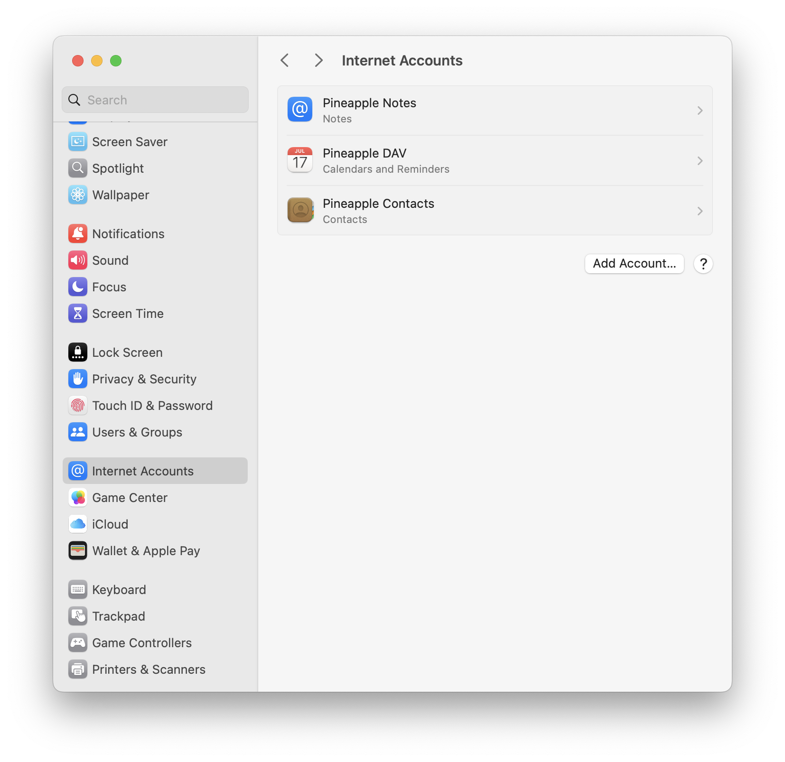
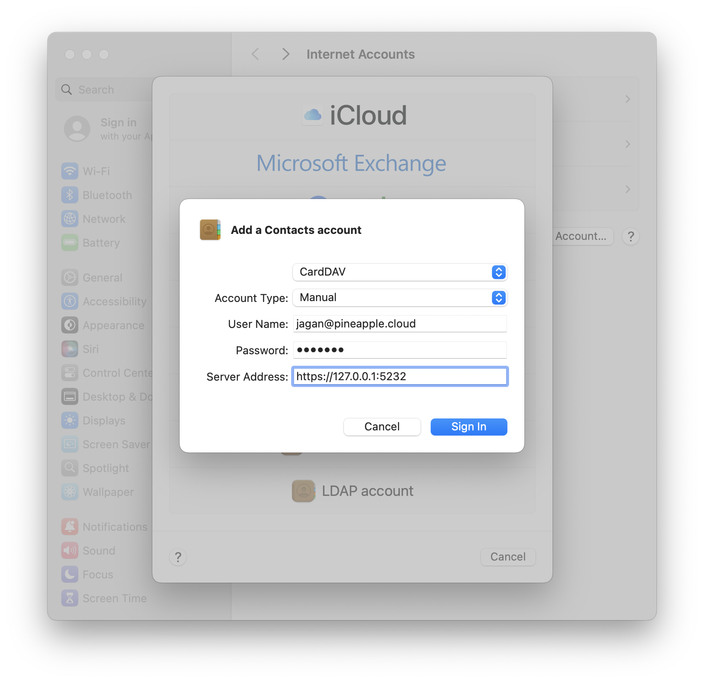
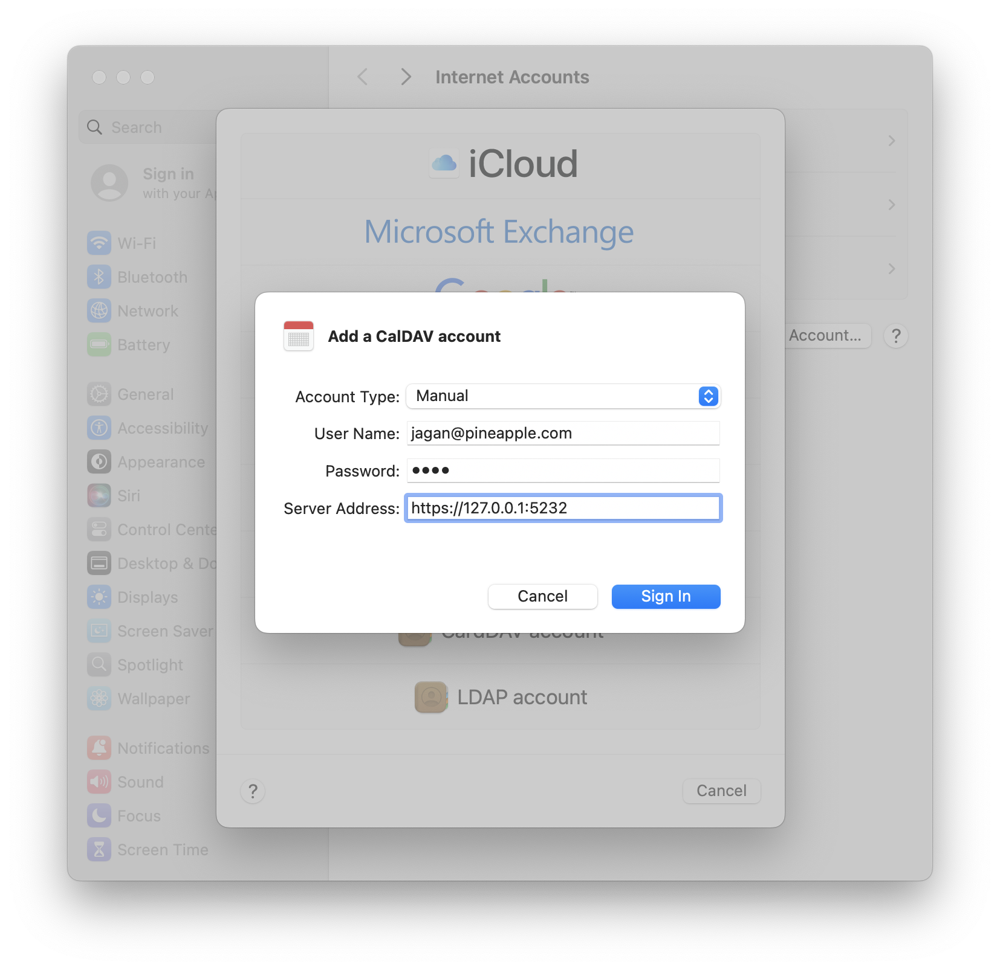
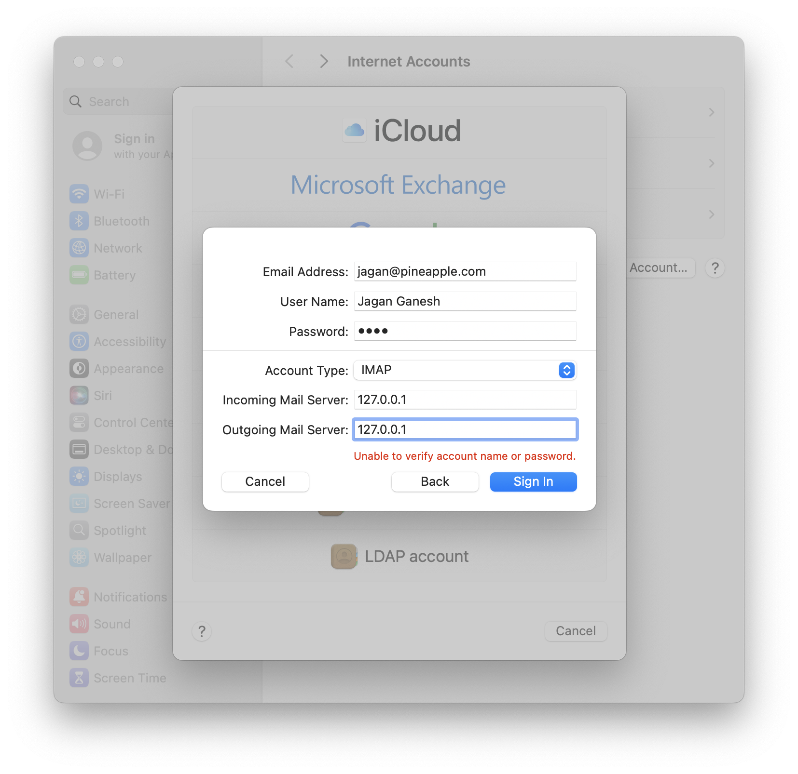

# 🍍 Pineapple Cloud


[](https://github.com/sponsors/jaganganesh)

> Keep your Apple ecosystem. Keep your data yours.

A lightweight, privacy-first, self-hosted iCloud alternative for Apple users.

Pineapple Cloud lets you sync natively:

- 📝 Apple Notes
- 🗓️ Calendar
- ✅ Reminders
- 👤 Contacts

across macOS and iOS using a minimal Docker stack powered by:

- CalDAV
- CardDAV
- Local IMAP

Designed for:

- Raspberry Pi
- Synology NAS
- Mini PCs
- Homelabs
- Privacy-conscious Apple users

All while using **under 100MB of idle RAM**.



# ✨ Why Pineapple Cloud?

Most self-hosted collaboration platforms are massive.

| Platform             | Typical RAM Usage |
| :------------------- | :---------------- |
| Nextcloud            | 1GB+              |
| Full mail suites     | Heavy             |
| Enterprise groupware | Complex           |
| **Pineapple Cloud**  | **<100MB**        |

Pineapple Cloud was built for people who want:

- native Apple app compatibility
- self-hosted privacy
- ultra-lightweight infrastructure
- simple Docker deployment
- zero vendor lock-in

No Electron apps.
No bloated dashboards.
No subscriptions.
No telemetry.

Just native Apple apps syncing directly with infrastructure you control.

# 🔒 Privacy First

Pineapple Cloud keeps your data:

- on your hardware
- inside your network
- under your control

No third-party cloud sync providers.
No analytics.
No forced accounts.
No external dependency chains.

Your Notes, Calendars, Contacts, and Reminders stay yours.

# 🚀 Features

- 🍎 Native Apple Notes sync using local IMAP
- 🗓️ Native Apple Calendar & Reminders sync via CalDAV
- 👤 Native Apple Contacts sync via CardDAV
- 🪶 Ultra-lightweight architecture (<100MB idle RAM)
- 🐳 Simple Docker Compose deployment
- 🏠 Optimized for Raspberry Pi and NAS systems
- 📦 Portable volume-based storage
- 🔒 Local-first privacy-focused design
- ⚡ Fast startup and low CPU overhead

# 🧠 How It Works

Apple uses multiple sync systems internally:

| Apple Service | Protocol |
| ------------- | -------- |
| Calendar      | CalDAV   |
| Reminders     | CalDAV   |
| Contacts      | CardDAV  |
| Apple Notes   | IMAP     |

Pineapple Cloud combines:

- **Radicale** → CalDAV + CardDAV
- **Local IMAP Mail Server** → Apple Notes syncing

inside a lightweight isolated Docker stack.

# 🏗️ Architecture

```text
             macOS / iPhone / iPad
                       │
        ┌──────────────┴──────────────┐
        │                             │
   Radicale Container           IMAP Container
 (Calendar / Contacts)          (Apple Notes)
        │                             │
        └────── Docker Network ───────┘
```

# ⚡ Quick Start

## 1. Clone the Repository

```bash
git clone https://github.com/jaganganesh/pineapple-cloud.git
cd pineapple-cloud
```

## 2. Create the Required Directories

```bash
mkdir -p \
data/mail-data \
data/mail-config \
data/radicale-data \
data/radicale-config \
data/radicale-certs
```

## 3. Create `docker-compose.yml`

```yaml
services:
  # Apple Notes (IMAP)
  imap-server:
    image: mailserver/docker-mailserver:latest
    container_name: apple-imap
    ports:
      - "143:143"
    environment:
      OVERRIDE_HOSTNAME: pineapple.cloud
      ENABLE_POP3: "0"
      ENABLE_SMTP: "0"
      ENABLE_SPAMASSASSIN: "0"
      ENABLE_CLAMAV: "0"
      ENABLE_FAIL2BAN: "0"
      ONE_DIR: "1"
    cap_add:
      - NET_ADMIN
    volumes:
      - ./data/mail-data:/var/mail
      - ./data/mail-config:/tmp/docker-mailserver
    restart: unless-stopped
  # Contacts / Calendars / Reminders (CardDAV, CalDav)
  radicale:
    image: tomsquest/docker-radicale:latest
    container_name: apple-dav
    ports:
      - "5232:5232"
    volumes:
      - ./data/radicale-data:/data
      - ./data/radicale-config:/config:ro
      - ./data/radicale-certs:/certs:ro
    restart: unless-stopped
```

## 4. Start the Stack

```bash
docker compose up -d
```

# 📬 Create Your Apple Notes Account

Apple Notes sync requires a local IMAP mailbox.

## Enter the container

```bash
docker exec -it apple-imap /bin/bash
```

## Create a user

```bash
setup email add your_name@pineapple.cloud
```

Then enter your password when prompted.

Exit the container afterward:

```bash
exit
```

# 🔐 SSL / TLS Setup

Apple devices strongly prefer encrypted connections.

## Option A — Self-Signed Certificates (Recommended)

Generate certificates locally:

```bash
openssl req -x509 \
-newkey rsa:4096 \
-keyout ./data/radicale-certs/server.key \
-out ./data/radicale-certs/server.cert \
-sha256 \
-days 3650 \
-nodes \
-subj "/CN=127.0.0.1"
```

On macOS:

1. Open `server.cert`
2. Launch **Keychain Access**
3. Set certificate trust to:
   - **Always Trust**

## Option B — Local HTTP Only

If running exclusively on:

- localhost
- isolated LAN
- private homelab subnet

you may choose to skip TLS.

macOS and iOS will display warning prompts during setup.

# 🍎 macOS Setup Guide

Open:

```text
System Settings → Internet Accounts
```

## 👤 Contacts (CardDAV)

Navigate to:

```text
Add Account → Add Other Account → CardDAV Account
```

Use:

| Field          | Value                  |
| -------------- | ---------------------- |
| Account Type   | Manual                 |
| Username       | Your Radicale username |
| Password       | Your password          |
| Server Address | 127.0.0.1              |
| Port           | 5232                   |
| Server Path    | /                      |

If using HTTP:

- Disable SSL

If using certificates:

- Enable SSL



## 🗓️ Calendars & Reminders (CalDAV)

Navigate to:

```text
Add Account → Add Other Account → CalDAV Account
```

Use the same credentials configured in Radicale.



## 📝 Apple Notes (IMAP)

Navigate to:

```text
Add Account → Add Other Account → Mail Account
```

Use:

| Field                | Value                                                         |
| -------------------- | ------------------------------------------------------------- |
| Email                | [your_name@pineapple.cloud](mailto:your_name@pineapple.cloud) |
| Incoming Mail Server | 127.0.0.1                                                     |
| Outgoing Mail Server | 127.0.0.1                                                     |

When setup completes:

- ❌ Disable Mail
- ✅ Enable Notes



# ⚠️ Apple Notes Limitations

Apple Notes over IMAP is more limited than native iCloud Notes.

The following features are reduced or unavailable:

- ❌ advanced typography styles
- ❌ rich heading templates
- ❌ interactive checklists
- ❌ inline sketches
- ❌ advanced embedded objects

For best compatibility:

- use standard text
- use bold/italics
- use markdown-style lists

Basic note synchronization works reliably.

# 🪶 Lightweight by Design

Pineapple Cloud is intentionally engineered for low-resource systems.

Perfect for:

- Raspberry Pi Zero 2 W, 3 Model B/B+, 400, 4 Model B, 5
- Synology J-series
- Intel N100 mini PCs
- Low-power NAS systems

Designed to minimize:

- RAM usage
- disk writes
- CPU overhead
- thermal load

Ideal for always-on homelab deployments.

# 🏠 Tested Platforms

- ✅ macOS
- ✅ iOS
- ✅ Apple Silicon Macs
- ✅ Raspberry Pi OS
- ✅ Ubuntu Server
- ✅ Docker
- ✅ Synology NAS

# 📦 Portable Storage Layout

All persistent data lives inside:

```text
./data
```

This makes migrations extremely simple.

Move your stack between machines by copying:

```text
./data
```

and redeploying the containers.

# 🆚 Comparison

| Feature               | Pineapple Cloud | Nextcloud | iCloud |
| --------------------- | --------------- | --------- | ------ |
| Apple Notes Sync      | ✅              | ❌        | ✅     |
| Native Apple Apps     | ✅              | Partial   | ✅     |
| Self-Hosted           | ✅              | ✅        | ❌     |
| Lightweight           | ✅              | ❌        | N/A    |
| Raspberry Pi Friendly | ✅              | ⚠️ Heavy  | ❌     |
| Docker Compose        | ✅              | ✅        | ❌     |
| Vendor Lock-In        | ❌              | ❌        | ✅     |
| Privacy First         | ✅              | ⚠️        | ❌     |

# 🧭 Why Self-Host?

Cloud convenience should not require surrendering ownership of your personal data.

Pineapple Cloud gives Apple users a way to preserve the native experience they already love while moving synchronization back onto infrastructure they control.

Your server.
Your rules.
Your data.

# 🤝 Contributing

Contributions are welcome.

1. Fork the repository
2. Create a feature branch

```bash
git checkout -b feature/amazing-feature
```

3. Commit your changes

```bash
git commit -m "feat: add amazing feature"
```

4. Push to your branch

```bash
git push origin feature/amazing-feature
```

5. Open a Pull Request

# ⭐ Support the Project

If Pineapple Cloud helped you reclaim ownership of your Apple data:

- ⭐ Star the repository
- 🍴 Fork the project
- 🧠 Share it with the self-hosted community
- 🛠️ Contribute improvements

Helping others discover the project makes a huge difference.

# ⚖️ License

Licensed under the GNU GPLv3 License.

See:

```text
LICENSE
```

for details.
